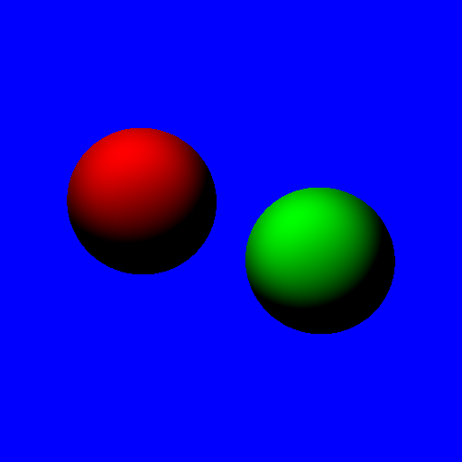
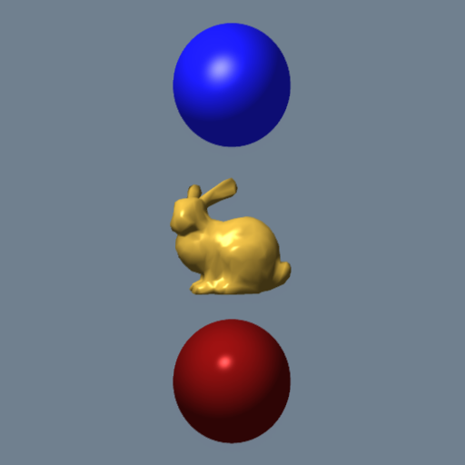
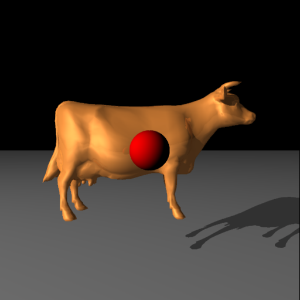

# arrt
**This is a personal project used for learning. Pull requests will mostly be ignored.**

A Rust Ray Tracer. This is my hobby project for learning Rust. This is  mostly based on a C++ ray
tracer I wrote many years ago in a grad school class where the curriculum was based on the book
"Ray Tracing from the Ground Up" by Kevin Suffern.

## Features

This ray tracer is exteremly basic right now but the following features are included:

* Sphere and simple mesh rendering
* Bounding volume hiearchy based on axis aligned bounding boxes
* Adaptive super sampling (1 - 2x)

Here are some examples of what it can currently prodcue:

## TODO

* reflections and refractions
* bezeir pathes/curves
