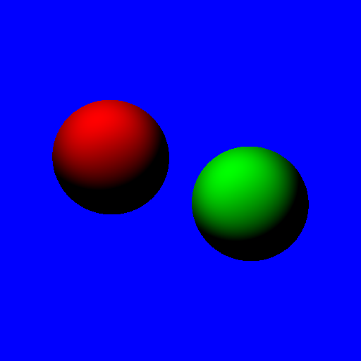
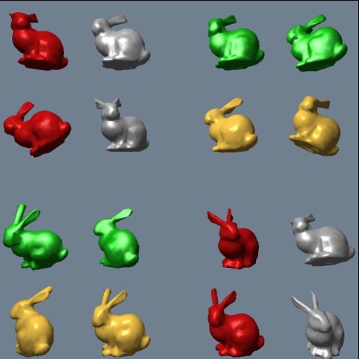
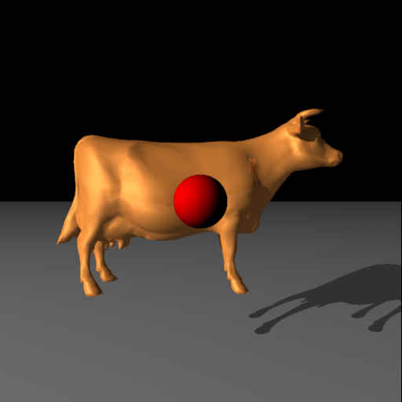
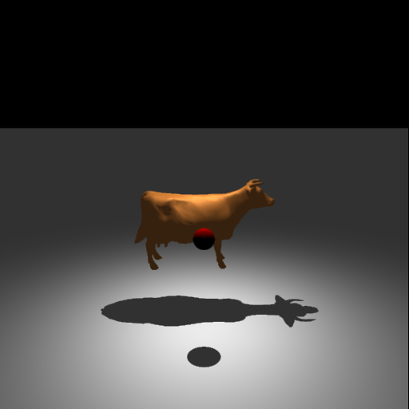
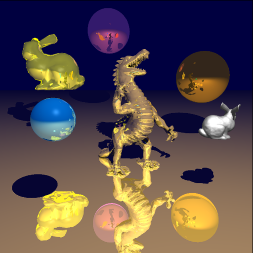
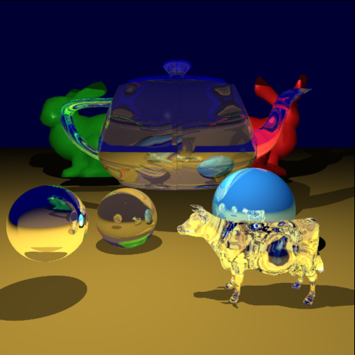
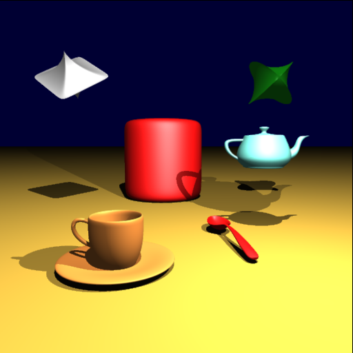
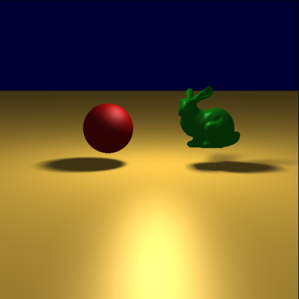
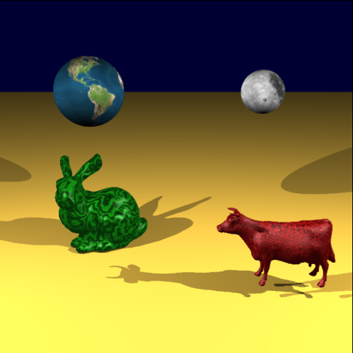

# arrt
**This is a personal project used for learning. Pull requests will mostly be ignored.**

A Rust Ray Tracer. This is my hobby project for learning Rust. This is mostly based on a C++ ray
tracer I wrote many years ago in a grad school class where the curriculum was based on the book
"Ray Tracing from the Ground Up" by Kevin Suffern.

## Features

This ray tracer is extremely basic right now but the following features are included:

* Triangle Meshes
  * Simple Mesh Format (.smf)
  * Superquadrics
  * Bezier Patches
  * Instancing
* Spheres and planes
* Bounding volume hierarchy based on axis aligned bounding boxes
* Phong/Hall shading with point, spot, and area light sources
  * Shadows
  * Reflection
  * Refraction
* Adaptive super sampling (1–2x)
* Parallelized tracing and rendering with rayon
* Texture mapping (image, checker, and marble)

Here are some examples of what it can currently produce:

|                                  |                                      |
| -------------------------------- | ------------------------------------ |
|      |        |
|        |           |
|     |   |
|       |    |
|  |                                      |

## Building

Requires a stable Rust toolchain (1.70+).

```sh
cargo build --release
```

## Running

```sh
cargo run --release -- --scene scenes/scene.yaml
```

The output image defaults to a PNG named after the scene file (e.g. `scene.png`) in the current
directory. Use `--image` to override:

```sh
cargo run --release -- --scene scenes/scene.yaml --image output.png
```

### CLI options

| Flag | Short | Default | Description |
|------|-------|---------|-------------|
| `--scene <PATH>` | `-s` | *(required)* | Path to the scene YAML file |
| `--image <PATH>` | `-i` | `<scene>.png` | Output image path |
| `--sampling-depth <N>` | `-S` | `2` | Adaptive supersampling depth: `0` = off, `1` = 1x, `2` = 2x |

### Logging

Set `RUST_LOG` to control log output:

```sh
RUST_LOG=info cargo run --release -- --scene scenes/scene.yaml
RUST_LOG=debug cargo run --release -- --scene scenes/scene.yaml
```

## Scene format

Scenes are defined in YAML. Each scene file must have a `materials.yaml` alongside it in the same
directory — that file defines the named materials referenced by objects in the scene.

### Top-level fields

```yaml
bgcolor:                # background color (r/g/b, each 0.0–1.0)
  r: 0.0
  g: 0.0
  b: 0.2
width: 512              # image width in pixels
height: 512             # image height in pixels
ambient:                # global ambient light color (default: white)
  r: 1.0
  g: 1.0
  b: 1.0
mesh_dir: models        # directory to resolve .smf mesh paths (default: "")
patch_dir: patches      # directory to resolve .bpt patch paths (default: "")
camera: ...
objects: ...
lights: ...
```

### Camera

```yaml
camera:
  eye:     [0.0, 0.5, 3.0]   # camera position
  up:      [0.0, 1.0, 0.0]   # world up vector
  look_at: [0.0, 0.0, 0.0]   # point the camera looks at
  dist:    1.0                # distance to the image plane
  fov:     60.0               # horizontal field of view in degrees
```

### Objects

Objects are tagged YAML variants. All mesh-based objects and spheres are placed into the BVH;
planes are unbounded and handled separately.

**Sphere**
```yaml
- !Sphere
    center: [0.0, 0.0, 0.0]
    radius: 1.0
    material: red
```

**Plane** (infinite, defined by a point and normal)
```yaml
- !Plane
    point:  [0.0, -1.0, 0.0]
    normal: [0.0,  1.0, 0.0]
    material: gold2
```

**Triangle mesh** (loads an .smf file)
```yaml
- !Model
    mesh: cow.smf             # resolved relative to mesh_dir
    material: bronze
    transform:
      translate: [0.0, 0.0, 0.0]
      scale:     [1.0, 1.0, 1.0]
      rotate:    [0.0, 0.0, 0.0]  # Euler angles in degrees (x, y, z)
```

**Superquadric** (tessellated into a triangle mesh)
```yaml
- !SuperQuadric
    a:       [1.0, 1.0, 1.0]  # axis radii
    e1:      0.2               # east–west roundness exponent
    e2:      1.0               # north–south roundness exponent
    vslices: 150               # vertical tessellation slices
    hslices: 100               # horizontal tessellation slices
    material: ruby
    transform:
      scale:     [1.5, 1.5, 1.5]
      translate: [-0.5, 0.5, -2.0]
```

**Bezier patch** (tessellated into a triangle mesh, loads a .bpt file)
```yaml
- !BPatch
    fpath: teapotCGA.bpt      # resolved relative to patch_dir
    material: turquoise
    slices: 32                 # tessellation subdivisions per patch
    flip_normals: false
    transform:
      translate: [0.0, 0.0, 0.0]
      rotate:    [0.0, 0.0, 0.0]
      scale:     [1.0, 1.0, 1.0]
```

### Lights

**Point light**
```yaml
- !Point
    position: [0.0, 2.0, 2.0]
    ambient:  {r: 0.0, g: 0.0, b: 0.0}
    diffuse:  {r: 1.0, g: 1.0, b: 1.0}
    specular: {r: 1.0, g: 1.0, b: 1.0}
```

**Spot light**
```yaml
- !Spot
    color:     {r: 1.0, g: 1.0, b: 1.0}
    position:  [0.0, 2.0, 0.0]
    direction: [0.0, -1.0, 0.0]
    angle:     60       # half-angle of the cone in degrees
    sharpness: 2        # falloff exponent
```

### Materials

Materials live in a `materials.yaml` file next to the scene file. Each entry is named and
referenced by objects using the `material:` key.

```yaml
- name: matte_red
  ambient:  {r: 0.9, g: 0.1, b: 0.1}
  diffuse:  {r: 0.9, g: 0.1, b: 0.1}
  specular: {r: 0.9, g: 0.5, b: 0.5}
  ka: 0.2       # ambient coefficient
  kd: 0.5       # diffuse coefficient
  ks: 0.7       # specular coefficient
  shininess: 30 # Phong shininess exponent

- name: mirror
  diffuse:  {r: 1.0, g: 1.0, b: 1.0}
  specular: {r: 1.0, g: 1.0, b: 1.0}
  kr: 0.9       # reflection coefficient (0 = none, 1 = perfect mirror)

- name: glass
  ambient:      {r: 1.0, g: 1.0, b: 1.0}
  diffuse:      {r: 1.0, g: 1.0, b: 1.0}
  specular:     {r: 1.0, g: 1.0, b: 1.0}
  transmissive: {r: 1.0, g: 1.0, b: 1.0}
  ks: 0.1
  kt: 0.9       # transmission coefficient (0 = opaque, 1 = fully transmissive)
  ior: 1.52     # index of refraction (glass ≈ 1.52, diamond ≈ 2.42)
  shininess: 1000
  highlight: 100  # transmitted specular highlight exponent
```

All color channels and coefficients default to sensible values when omitted (`ka`, `kd`, `ks`
default to 1.0; `kr`, `kt`, `ior`, `highlight` default to 0.0).
